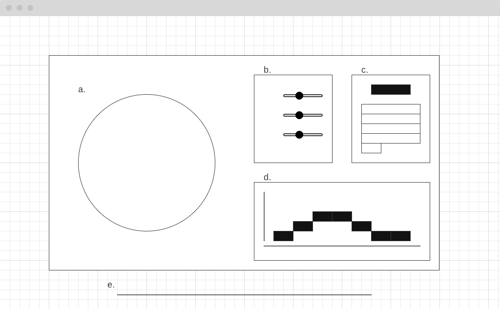

# Weather To Go

## Background
This project is to show travel destination recommendations depending on the average monthly weather during the year.

It will have an interactive map and a setting panel that allows the user to pick their desired weather and month.

## Features
* Displays a global map with popular travel destinations
* Displays destinations based on user settings
* Displays monthly average temperature of the selected destination

## Technologies
* Vanila `JavaScript` as a base
* `D3.js` for rendering
* World Bank's Climate Data API
* `Webpack` to bundle `js` files

## Wireframes
The page consists of a single screen(a), with tempearature, wind, and precipitation settings(b), calendar view(c), monthly average weather data of selected destination(d), and links to the API, Github, and LinkedIn, with copyright(e).

## Implementation Timeline
  
### Day 1
- [x] Gather all the API endpoints and data from the NOAA (APIs)
- [x] Find a way to calculate/compile all the necessary weather data points
- [x] Setup Node backedn for API calls

### Day 2
- [ ] Render 2D global map using `D3.js` 
- [ ] Render temperature and precipitation chart
- [ ] Render and gather temperature and precipitation settings
- [ ] Render calendar
- [ ] Filter data based on the setting
- [ ] Display the data onto the map
- [ ] Display the data on the chart

### Day 3
- [ ] Make the map interactive and allow a user to select a country without setting the temperature and precipitation settings
- [ ] Show temperature and precipitation data also on the calendar

### Day 4
- [ ] Add all the links and styling
- [ ] Make sure all the credits are given to right people/organization

### Bonus feature
- [ ] Dark mode
- [ ] 3D map
- [ ] Switch between data based on historical average/forcasts